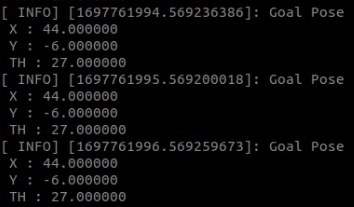
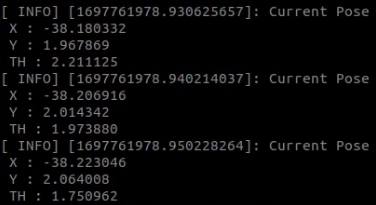
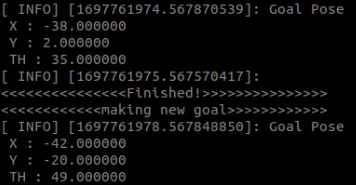
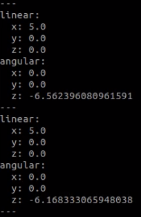

# Assignment 2 - Donghyung(Dean)

## Assignment Interpretation
* develop two cpp or python files, the controller and the driver.

* The driver's topic/msg 
    1) constantly publishes the goal_pose (x,y,\theta).

* The controller's two topics/msgs
    1) a publisher that publishes the current pose.
    1) a publisher/advertise cmd_vel.

* The controller implements a simple differential driver inverse kinematics of a mobile robot to determine the path of the robot.

## Brief Description
* driver.cpp (link : ~/assn2/src/assn2/src/driver.cpp)
1. publish goal_pose_x, y, theta
2. subscribe current_pose_x, y, theta
3. if it's arrived, publish new goal randomly

<br/>

* controller.cpp (link : ~/assn2/src/assn2/src/controller.cpp)
1. subscribe goal_pose_x, y, theta
2. init current_pose is 0
3. calculate required cmd_vel with current, goal pose, and publish it
4. calculate current_pose_x, y, theta with equations, and publish it

## Instruction
Installation
```
$ cd
$ git clone https://github.com/eastbright99/CPE-476_Assignment_Submissions.git
$ cd CPE-476_Assignment_Submissions/assn2
$ catkin_make
```

<br/>

Execution
```
$ roscore
$ source ~/CPE-476_Assignment_Submissions/assn2/devel/setup.bash
$ rosrun assn2 driver
$ rosrun assn2 controller
```

<br/>

Description
driver will keep publishing new goal_pose randomly, if it's arrived
controller will keep fallowig goal_pose, and showing current_pose

## Screenshots
Driver pub goal_pose  


<br/>

Controller pub current_pose  


<br/>

Arrived and Newgoal  


<br/>

Current cmd_vel  


## Video
Execution video [LINK](https://youtu.be/NaodVQfLnjE).
