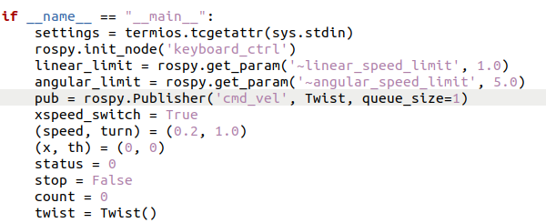

# Assignment 3 - Donghyung(Dean)

## #1 modify the URDF

based on "drive_robot.launch" you just need to modify the "mobile_robot.urdf.xacro" file

<br/><br/>

1) change chassis size
  

2) change wheel joint's position
  

<br/><br/>

## #2 Display robot with Rviz


<br/><br/>

## #3 Move robot with rqt_robot_steering
after you type these
```
roslaunch ros_mobile_robot drive_robot.launch
rosrun rqt_robot_steering rqt_robot_steering
```


you can see robot move with[rqt_robot_steering](https://youtu.be/mS8J2_pSlNk)

<br/><br/>

## #4 Move robot with keyboard
if you type this
```
rostopic list
```

you can find robot moves based on "/robot_diff_drive_controller/cmd_vel" topic

<br/><br/><br/>


so in "yahboom_keyboard.py"<br/>
you need to modify 'cmd_vel' -> 'robot_diff_drive_controller/cmd_vel'

<br/><br/>

after finishing change, type these
```
roslaunch ros_mobile_robot drive_robot.launch
roslaunch yahboomcar_ctrl yahboom_keyboard.launch
```


you can see robot[move with keyboard](https://youtu.be/mS8J2_pSlNk)

<br/><br/>
