# Assignment 4 - Donghyung(Dean)

## #1 Setup robot (instant assemble)
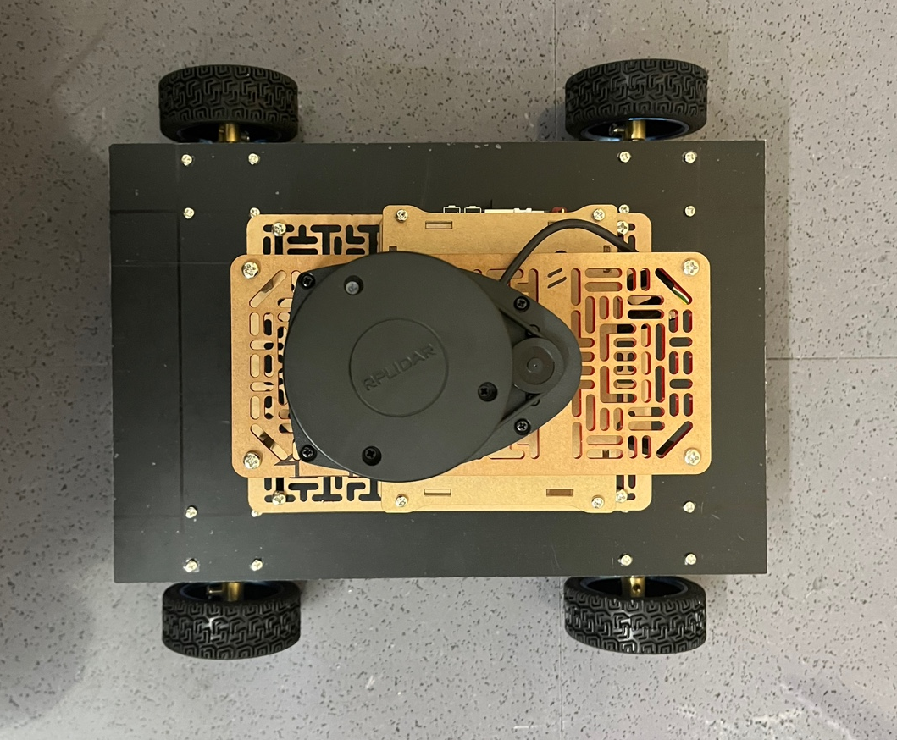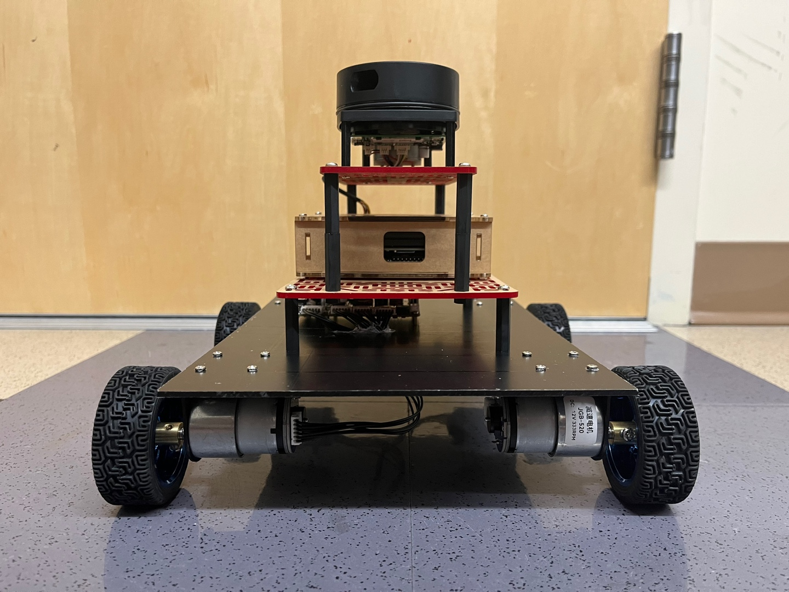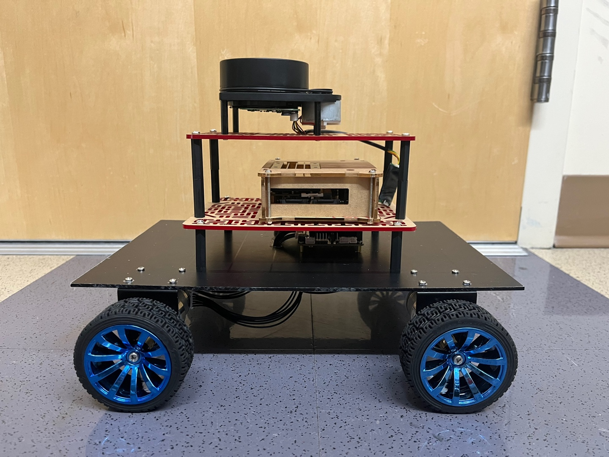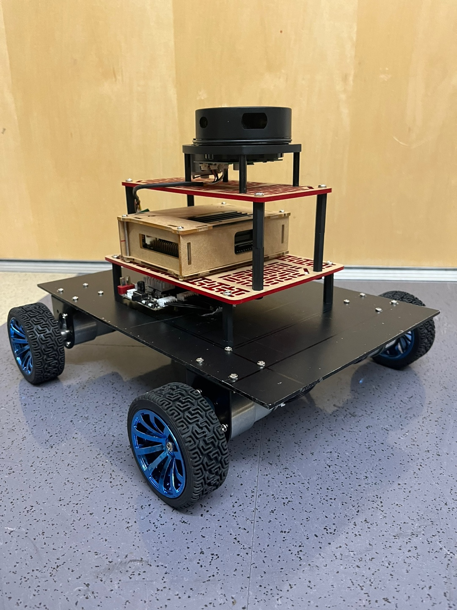

## #2 Controller Setup and Test

* Motor Test
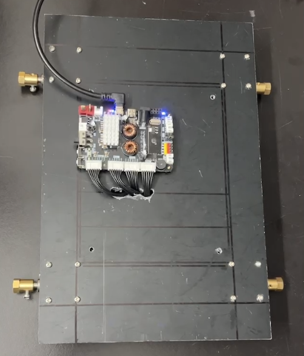
[Motor Test vid](https://youtu.be/NaodVQfLnjE).  

* Encoder Test
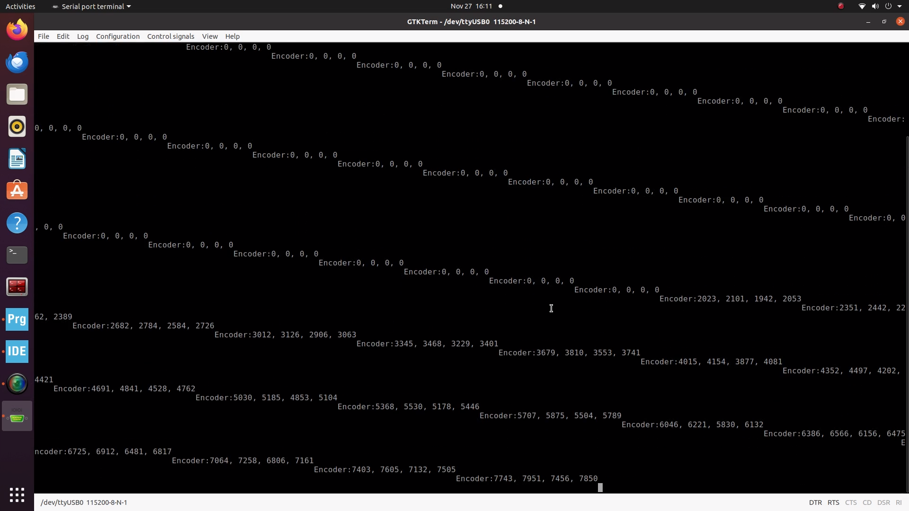
[Encoder Test vid](https://youtu.be/NaodVQfLnjE).  

* IMU Test

[IMU Test vid](https://youtu.be/NaodVQfLnjE).  

* Drive Test
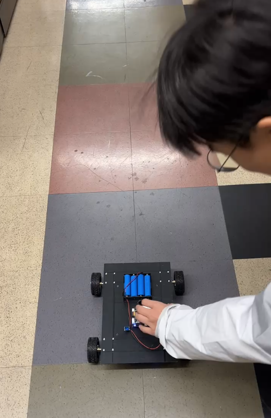
[Drive Test vid](https://youtu.be/NaodVQfLnjE).

## #3 Jetson nano Setup

* Jetson nano Desktop
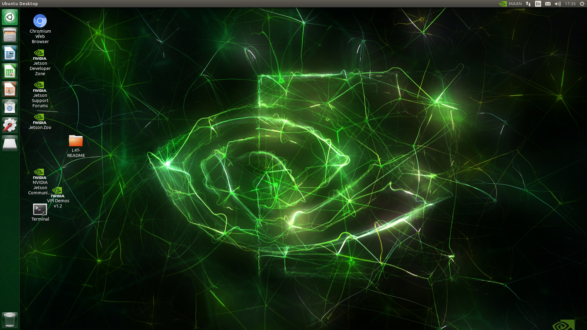

* ROScore check
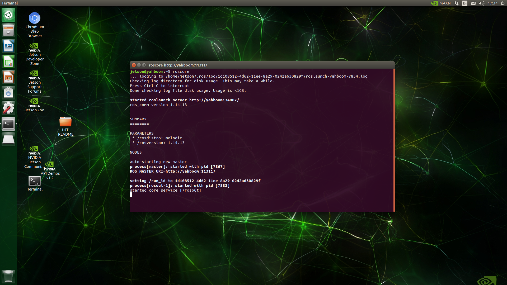

* Directories check
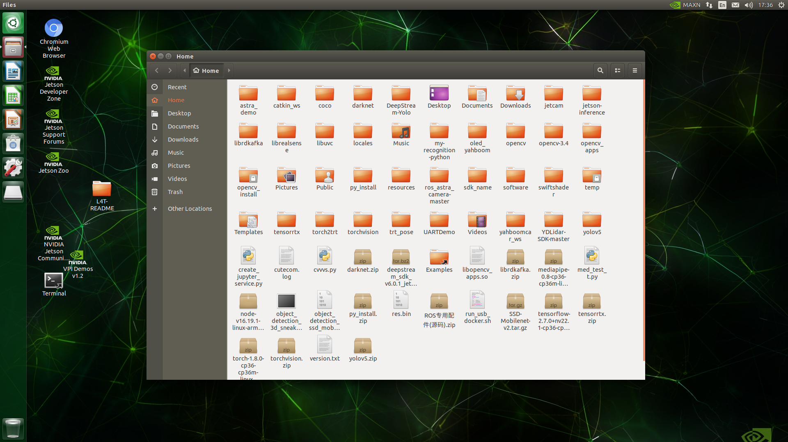

## #4 Calibrate Robot

## #5 Lidar Setup and Test

* running Lidar with Rviz
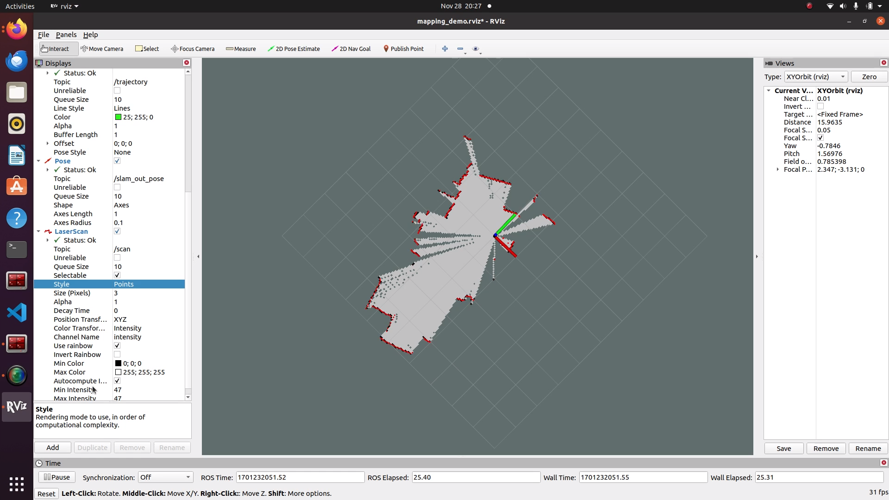
[Lidar Test vid](https://youtu.be/NaodVQfLnjE).

