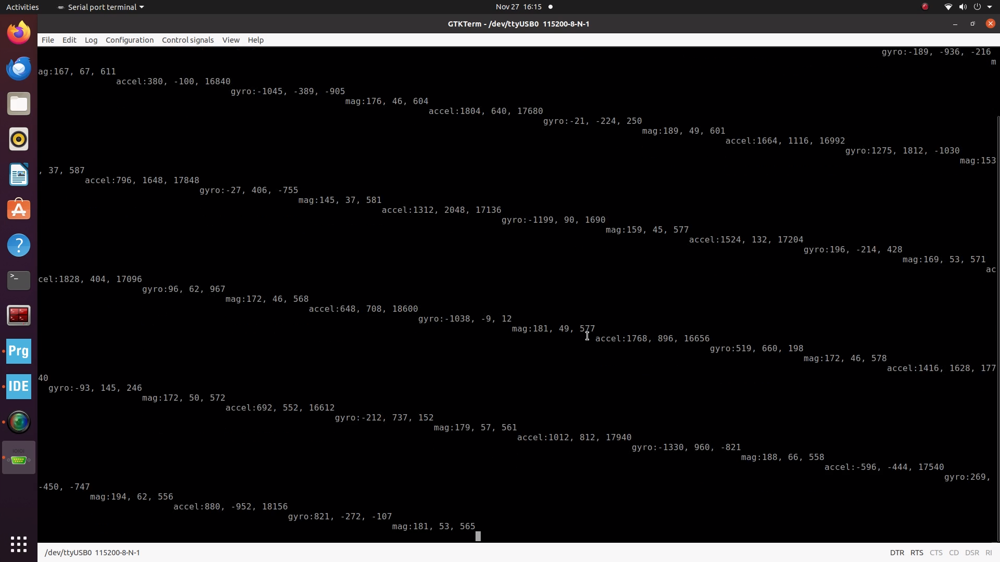
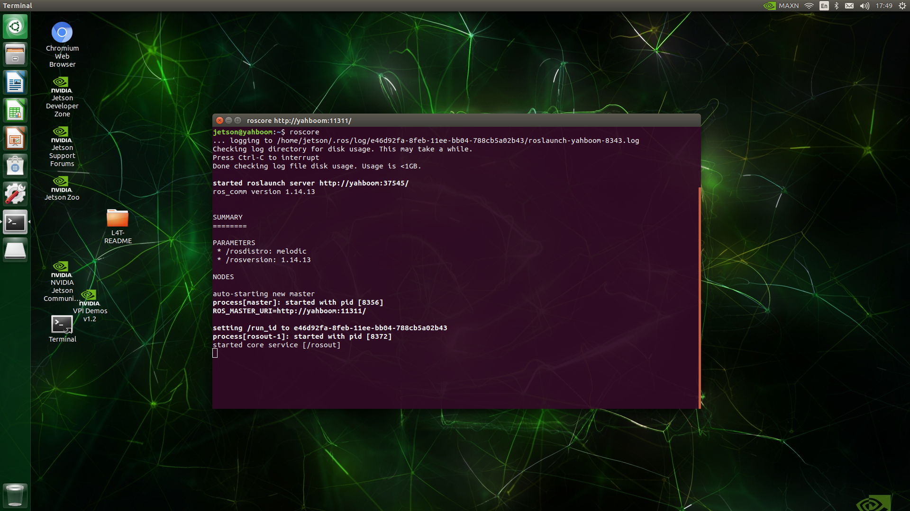

# Assignment 4 - Donghyung(Dean)

## #1 Setup robot (instant assemble)

   
## #2 Controller Setup and Test
* STM hex file download

   

* Motor Test

[Motor Test vid](https://youtube.com/shorts/FEDPxpPm5LE)

   

* Encoder Test

[Encoder Test vid](https://youtu.be/XNeViqGiyZg).  

   

* IMU Test

[IMU Test vid](https://youtu.be/aI7jzNcRZzI).  

   

* Drive Test

[Drive Test vid](https://youtube.com/shorts/gPzR5lazhyQ?feature=share).
   
## #3 Jetson nano Setup

* Jetson nano Desktop

   

* ROScore check

   

* Directories check

   

## #4 Calibrate Robot

   

## #5 Lidar Setup and Test

* running Lidar with Rviz

[Lidar Test vid](https://youtu.be/mS8J2_pSlNk).

   

