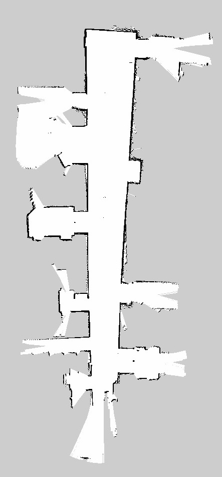

# Assignment 5 - Donghyung(Dean)

## #1 Mapping
### Mapping Test  

[Mapping Test vid](https://youtu.be/trhHgOyOMUs)

   

### Sample Datas  
Lab  

 

Seb 3rd Floor  
  
  

   

## #2 Navigation

### Navigation Test  

[Navigation Test vid](https://youtu.be/-R1TFmbU0J0)

   

### Main Function
 : enter your current position

 

 : enter your goal position

   

### Results and Discussion
Everything generally proceeds smoothly when we provide proper  and .  
However, a navigation error occurs in the second video between 1:35 and 2:30.  
I believe there are several possible reasons for this issue.  
 
Firstly, there is a height disparity between the lidar and the wheels. For instance, from the perspective of a wheel, an obstacle might appear in front of the rover. However, since the lidar is positioned at the top, it perceives the space above and may not detect any obstacles.  
 
Secondly, the rover may require sufficient space for steering. In narrow spaces, it produces mixed outputs, causing the rover to come to a stop in its current position.  
 
Finally, there seems to be an odometry gap between the calculated movement and the actual rover position. To be more specific, the program commands output a certain movement, but due to a slip between the wheels and the floor, the rover doesn't actually move as expected.  

  
